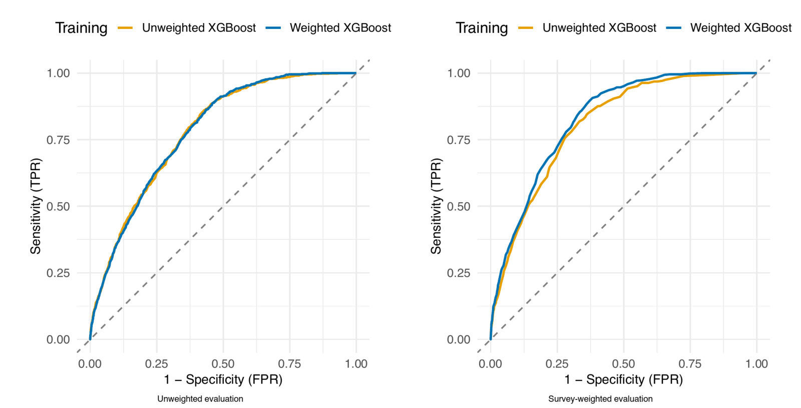

# Survey-aware Machine Learning (SaML)

*A guideline for valid population health inference based on a scoping review.*
Public reproduction package for the paper accepted to the **Conference on
Health, Inference, and Learning (CHIL) 2026** *(in press)*.

Paper: CHIL 2026 (accepted, in press) · arXiv: <https://arxiv.org/abs/2605.08963>



> Logistic regression for diabetes on NHANES 2021–2023 (age, BMI). The two
> panels show the same model evaluated under standard *unweighted* metrics and
> *survey-weighted* metrics. The gap between the two panels is the central
> empirical message of the paper.

## Abstract

Machine Learning (ML) models trained on complex health surveys such as the
National Health and Nutrition Examination Survey (NHANES) often ignore primary
sampling units, stratification variables, and sampling weights. This practice
violates the independence assumptions of standard evaluation methods. As a
result, estimates become biased, uncertainty is underestimated, and fairness
assessments fail to reflect population-level disparities. We propose
**Survey-aware Machine Learning (SaML)**, a nine-step guideline that
incorporates survey design metadata across the ML lifecycle. Through a scoping
review of 16 methodological papers, we summarize existing work on weighted
model training, design-based cross-validation, and survey-adjusted performance
evaluation. We also identify gaps in hyperparameter tuning and deployment. We provide
task-specific guidance that clarifies which steps are required for different
analytical objectives. SaML provides a checklist for valid population
inference from survey data.

## Authors

- **YongKyung Oh** — yongkyungoh@mednet.ucla.edu
- **Henry W. Zheng** — henryzheng@ucla.edu
- **Jeffrey Feng** — j64feng@ucla.edu
- **Alex A. T. Bui**† — buia@mii.ucla.edu

All authors: Medical & Imaging Informatics (MII), UCLA.
† Corresponding author.

## What this repository contains

This repository is the **empirical illustration** that accompanies the SaML
paper (Appendix: NHANES 2021–2023 case study). It is *not* the scoping-review
database. It reproduces the four experiments reported in the paper on a frozen
NHANES-derived cohort:

- public R scripts for Experiments 1–4
- frozen input data used by the release
- baseline result fixtures for verification
- reproducibility notebooks and a one-command verifier

## Repository layout

```text
SaML/
├── code/              # public preprocessing + Experiment 1–4 scripts
├── data/              # frozen, curated release inputs (NHANES 2021–2023)
├── expected/          # frozen baseline result fixtures
├── notebooks/repro/   # reproducibility notebooks and verifier
├── assets/figures/    # README assets
├── environment.yml    # conda environment (R 4.5.2 + survey, xgboost, …)
├── LICENSE
└── README.md
```

## Reproducing the empirical study

### Environment

The release pins R 4.5.2 with `survey`, `xgboost`, `glmnet`, `pROC`, and the
tidyverse via conda-forge.

```bash
conda env create -f environment.yml
```

### Run the experiments

From the repository root:

```bash
conda run -n rlab Rscript code/01_experiment1_descriptive.R
conda run -n rlab Rscript code/02_experiment2_evaluation.R
conda run -n rlab Rscript code/03_experiment3_training.R
conda run -n rlab Rscript code/04_experiment4_cv_factorial.R
```

Outputs are written to `results/` (gitignored).

Approximate runtimes on a reference machine:

- Experiment 1: ~10 seconds
- Experiment 2: ~1 minute
- Experiment 3: ~4 minutes
- Experiment 4: ~15–20 minutes

### Verify reproducibility

From `notebooks/repro/`:

```bash
bash verify_all.sh
```

Each notebook's final cell compares regenerated outputs against the frozen
fixtures in [expected/](expected/) and reports PASS/FAIL.

## Experiments

Each experiment validates one or more steps of the SaML guideline (S1–S6).

- **Experiment 1 — Descriptive (S1: Data preprocessing & EDA).** Compares
  unweighted sample statistics with design-weighted population estimates.
  Reproduces the headline finding that the unweighted mean age exceeds the
  weighted estimate by ~5.1 years (≈9.4%) and that diabetes prevalence shifts
  from 14.9% (unweighted) to 12.1% (population-weighted).

- **Experiment 2 — Evaluation (S5: Performance evaluation, S6: Uncertainty).**
  Logistic regression for diabetes from age and BMI. Reproduces the AUROC
  shift from 0.743 (95% CI 0.727–0.758) under unweighted evaluation to 0.775
  (0.749–0.793) under survey-weighted evaluation.

- **Experiment 3 — Training (S3: Model training, S5: Evaluation).** A 2×2
  factorial XGBoost study (training with/without survey weights ×
  evaluating with/without survey weights). Reproduces the result that the
  benefit of weighted training is only visible under weighted evaluation.

- **Experiment 4 — Cross-validation (S2: Data splitting, S4: Hyperparameter
  tuning).** A 2×2×2 factorial over CV scheme (random vs PSU-level) ×
  training × evaluation. Reproduces the paper's descriptive comparison:
  PSU-level CV yields slightly lower mean AUROC with smaller fold-to-fold
  standard deviation than random CV, with the caveat that only 6 of 15
  planned PSU folds were usable, so the paper treats this as a descriptive
  comparison rather than a definitive ranking of estimator reliability.

## Data availability

The empirical illustration uses the **NHANES 2021–2023** cycle, publicly
released by the U.S. Centers for Disease Control and Prevention (NCHS):
<https://www.cdc.gov/nchs/nhanes/>.

The shipped frozen inputs in [data/](data/) are derived from the public-use
tables `DEMO_L`, `BMX_L`, `BPXO_L`, and `DIQ_L`. The analytic cohort restricts
to adults (`RIDAGEYR ≥ 20`) with positive examination weights
(`WTMEC2YR > 0`); see [data/README.md](data/README.md) for the full filter
chain, source tables, and attribution notes.

## Ethics

The research presented in this paper consists of a systematic audit of
published methodological practices and synthesis of existing literature. It
does not involve interaction with human subjects or the use of private,
identifiable individual data. According to U.S. Department of Health and Human
Services guidelines, this study is categorized as **Not Human Subject Research**
and did not require IRB approval.

## License

Released under the MIT License — see [LICENSE](LICENSE).

## Citation

If you use this code or build on the SaML guideline, please cite the arXiv
preprint until the official CHIL 2026 proceedings metadata appears:

```bibtex
@misc{oh_survey-aware_2026,
  title     = {Survey-aware Machine Learning: A Guideline for Valid
               Population Health Inference based on Scoping Review},
  author    = {Oh, YongKyung and Zheng, Henry W. and Feng, Jeffrey and
               Bui, Alex A. T.},
  publisher = {arXiv},
  year      = {2026},
  doi       = {10.48550/arXiv.2605.08963},
  url       = {https://arxiv.org/abs/2605.08963}
}
```

## For maintainers

These steps are not required to reproduce the paper.

- `code/00_preprocessing.R` regenerates the preprocessing artifacts from raw
  NHANES tables via `nhanesA::nhanes()` (requires internet). It writes to
  `results/` and does **not** overwrite the frozen files in [data/](data/).
  Install the extra dependency separately:
  ```bash
  Rscript -e "install.packages('nhanesA', repos='https://cloud.r-project.org')"
  ```
- `notebooks/repro/build_repro_notebooks.py` regenerates the verifier
  notebooks committed under [notebooks/repro/](notebooks/repro/).
